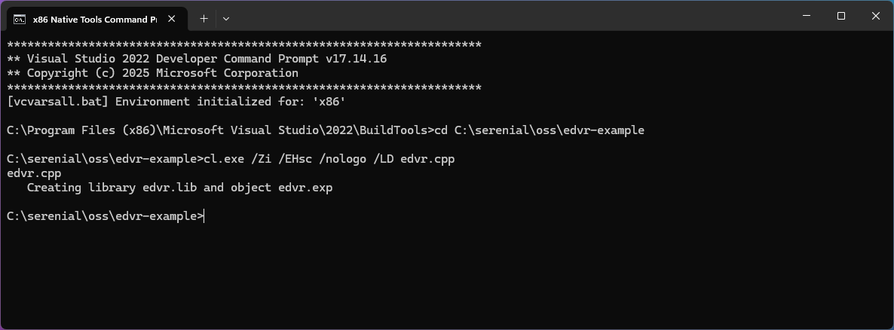
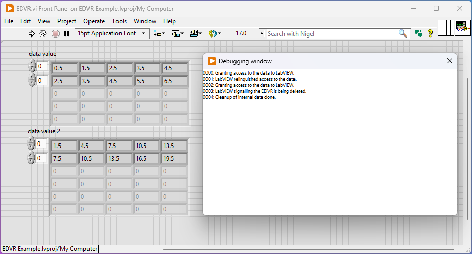
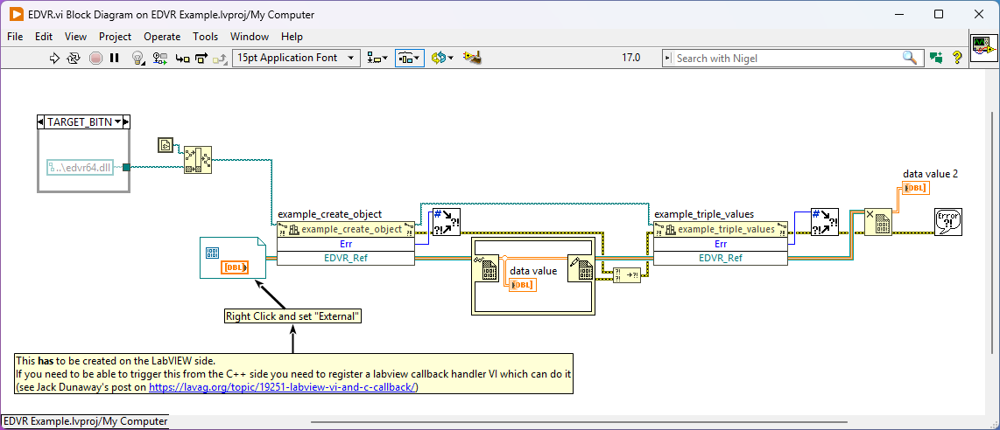

# LabVIEW External Data Value Reference Minimal C++ Example

This is a 300 line self contained example of how to use EDVR in C++ with LabVIEW on Windows.

The code imports the `EDVR` functions exported by the LabVIEW IDE/Runtime so it can be compiled without any linkage to ni provided binaries.

The code is only written for compilation on windows with MSVC. If you want a more complete example of cross-platform then see https://gitlab.com/serenial/g-augmented-reality-toolkit

# Building 

Binaries are provided but should you with to modify them then launch the MSVC developer prompt with the bitness you need (x86 or x64) and use the following

```powershell
cd <directory of this repo>
cl.exe /Zi /EHsc /nologo /LD edvr.cpp
```



# Usage

Open the LabVIEW project (files saved as LV 2017) and run the code



